## Rhys Morris Portfolio Site

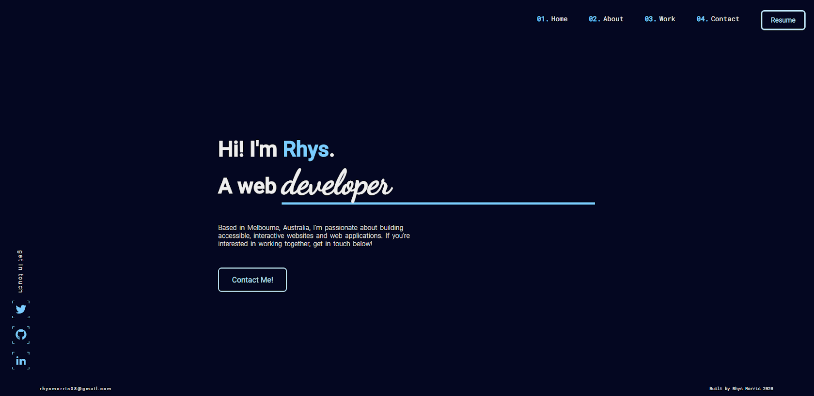

Deployed [**portfolio site**](https://rhysmorrisdeveloper.netlify.app/).

Github [**repository**](https://github.com/Rhys-Morris/portfolio-submission).

### Website description

This website was designed and built to:
1.  Demonstrate my technical and professional skillset as a web developer.
2.  Serve as a portfolio showcase that can be expanded upon as I progress through the Coder Academy course.

The target audience of this website is an employer looking to engage a web developer.

### Functionality / Features

- Hero section
    - Custom CSS animations
    - Scripted ripple effect on click events
- About section
    - Background information on myself
    - Outside links to relevant information
    - Scripted slideshow of latest blog posts
    - Link to personal blog
- Work section
    - Outline of technology proficiency
    - Project cards with outside links to source code (github repository) and deployed project
    - Further CSS animation implementation utilising CSS Animations library
- Contact section
    - Functional form submission via formspree
    - Form validation styling with javascript
    - Embedded google map showing location, altered using CSS filters
- Blog
    - Drop down navigation on scroll event
    - Scroll in blog posts
- Other
    - Fully responsive design
    - Hamburger navigation implementation on smaller screens
    - Links to social media platforms
    - Easter egg!

### Tech Stack

- HTML 5
- CSS 3
- Sass
- Git/Github version control
- Node Package Manager
- Javascript
- Deployment via Netlify

### Sitemap

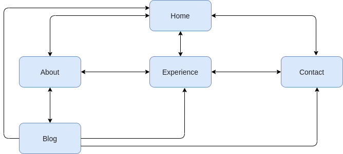

### Screenshots

#### **Wireframing examples through Balsamiq:**

#### Hero section

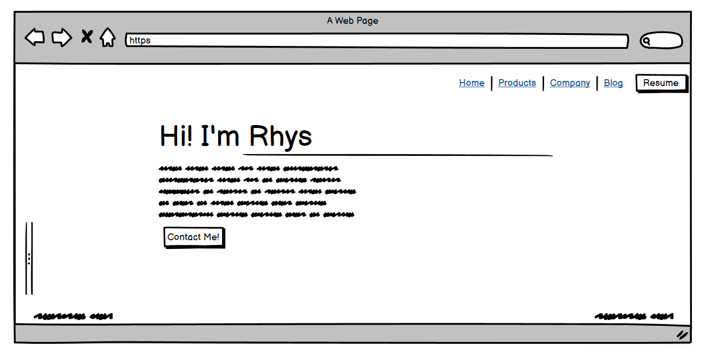
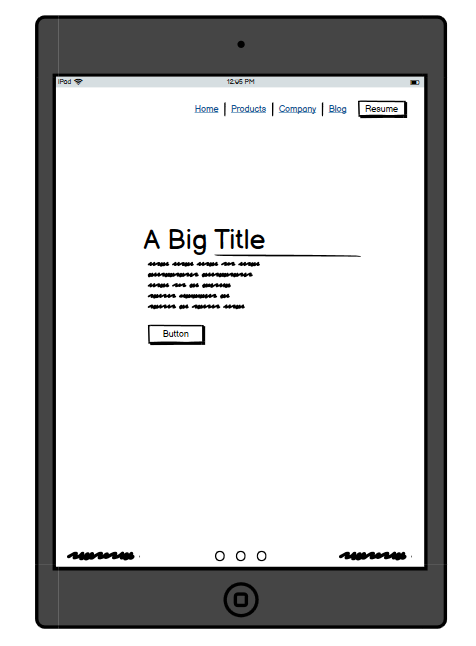
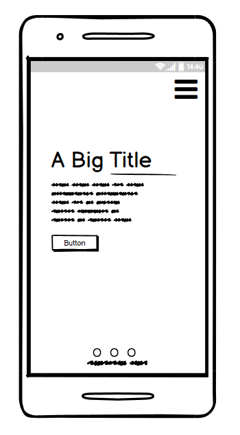
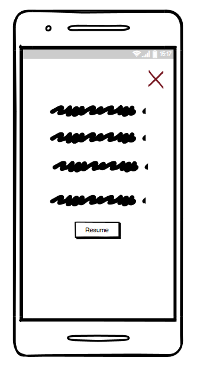

#### About section

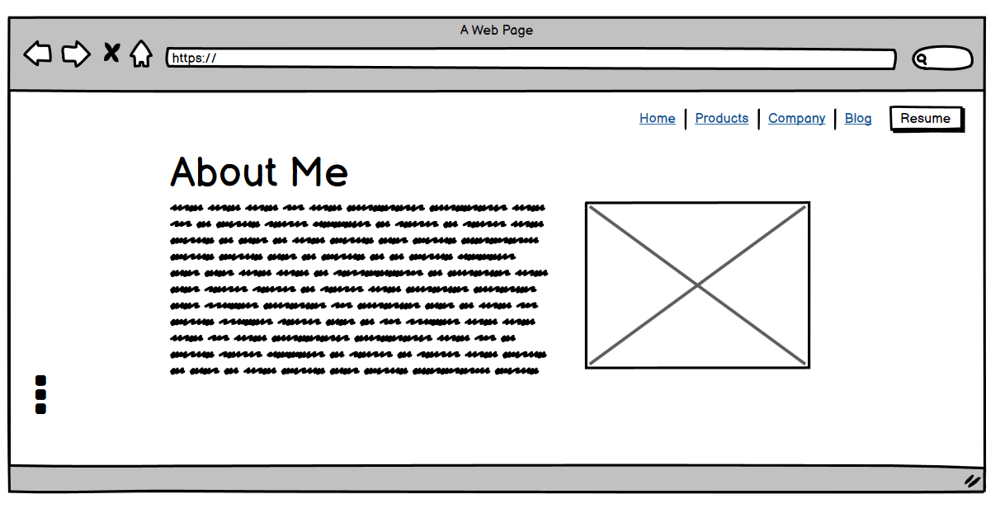
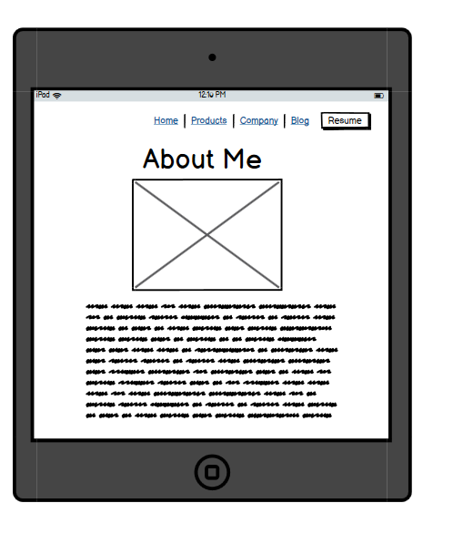
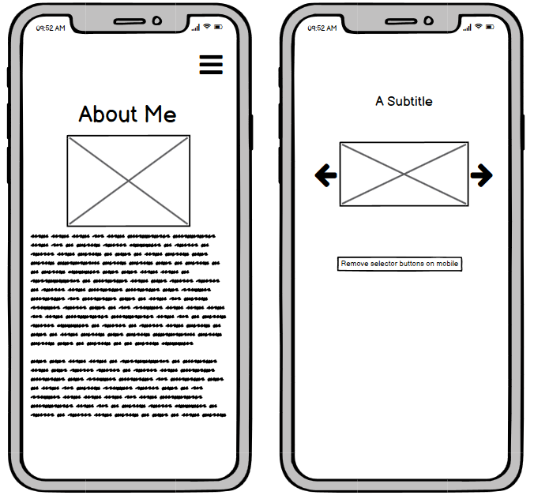

#### Work section

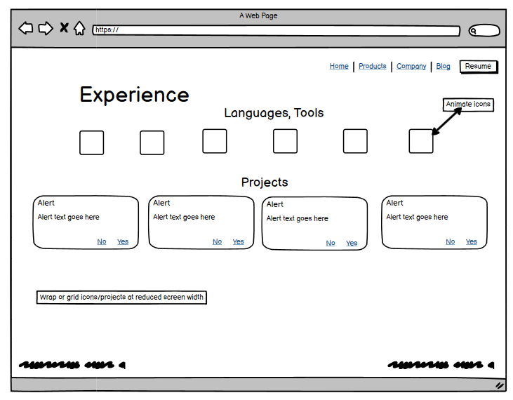
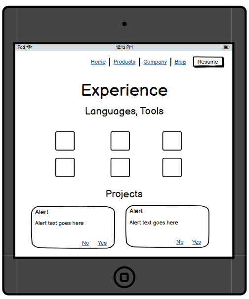
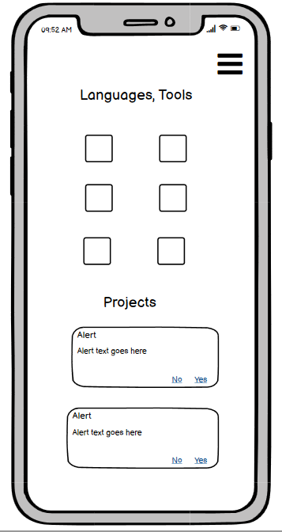

#### Contact section

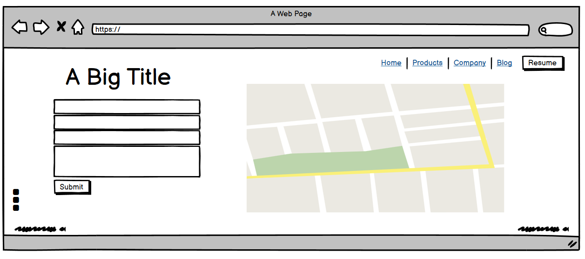
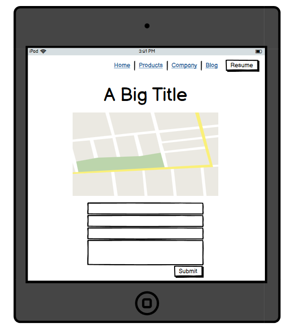
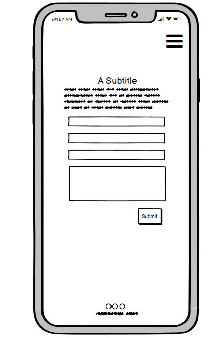

#### Blog section

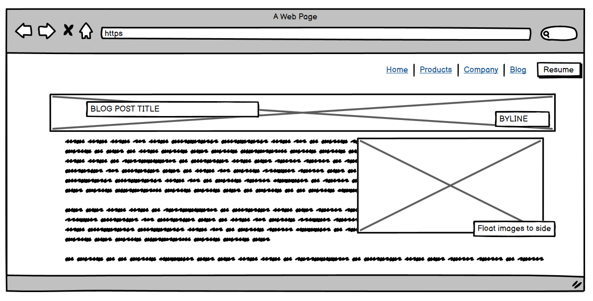
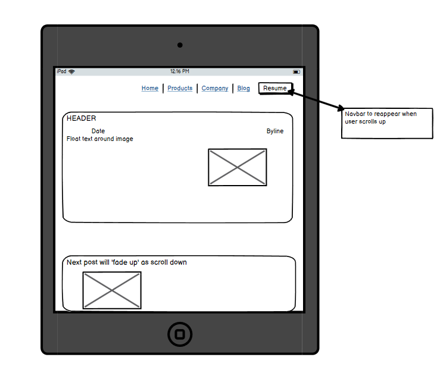
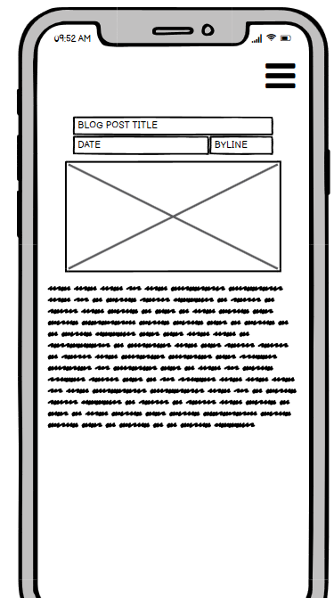